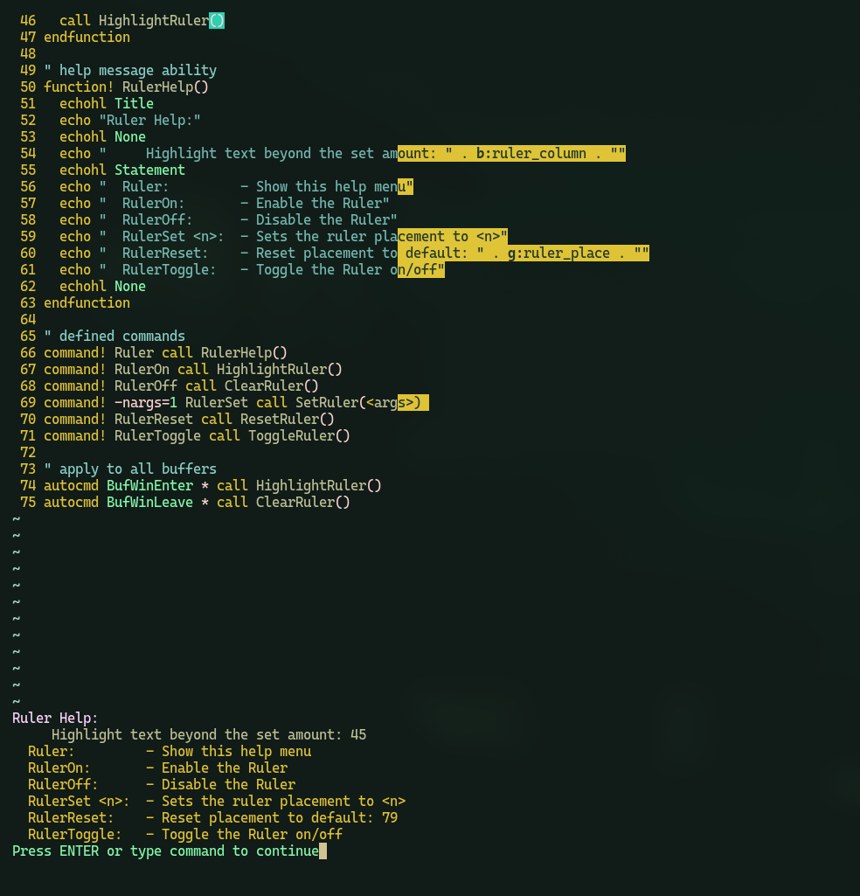

# Ruler

Highlight all text past a certain char.  Global, persistant, multiple instances.

## Install Instructions:

### Manual Install
1) Move Ruler.vim to ~/.vim/plugin/Ruler.vim
For use with vim-plug, add the following line to your vimrc:
Plug 'yourusername/Ruler'
2) Restart Vim.
3) Run :PlugInstall within Vim
4) Done!

### For use with lazy.nvim, Pathogen, Vundle, etc:
In your terminal:
1) mkdir -p ~/.vim/pack/plugins/start
2) cd ~/.vim/pack/plugins/start
3) git clone https://github.com/brianspragge/Ruler.git

# PREVIEW

